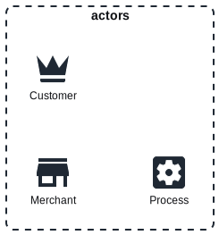

# Domain Storytelling with PlantUML

DomainStory-PlantUML uses [PlantUML](http://en.plantuml.com/) to describe and
document a domain story which was developed in a
[Domain Storytelling](http://www.domainstorytelling.org) workshop.

***Table of Contents***

* [Getting Started](#getting-started)
    * [Basic Concepts](#basic-concepts)
* [Basic Features](#basic-features)
    * [Basic Story Layout](#basic-story-layout)
    * [Auto-Incrementing Steps](#auto-incrementing-steps)
    * [Adding Notes or Annotations](#adding-notes-or-annotations)
    * [Basic Styling](#basic-styling)
    * [Extensions](#extensions)
* [Advanced Features](#advanced-features)
    * [Dynamic Creation of Work Objects](#dynamic-creation-of-work-objects)
    * [Advanced Story Layout](#advanced-story-layout)
* [Advanced Samples](#advanced-samples)
    * [Cinema](#cinema)
    * [Airport Bus](#airport-bus)
* [License](#license)
* [Acknowledgements](#acknowledgements)

## Getting Started

At the top of your domain story `.puml` file,
you need to include the `domainStory.puml` file found in the root of this repository.

The library is now part of the [PlantUML Standard Library](https://plantuml.com/en/stdlib)
and may be included via

```puml
!include <domainstory/Domainstory>
```

If you want to use the always up-to-date version in this repository,
use the following `include` definition

```puml
!include https://raw.githubusercontent.com/johthor/DomainStory-PlantUML/main/domainStory.puml
```

To be independent of any internet connectivity,
you can also download the file found in the root
and reference it locally with

```puml
!include path/to/domainStory.puml
```

After you have included `domainStory.puml` you can use the predefined macro
definitions for the domain story actors:

* `Person($name[, $label][, $note][, $shape][, $scale][, $color][, $background])`
* `Group($name[, $label][, $note][, $shape][, $scale][, $color][, $background])`
* `System($name[, $label][, $note][, $shape][, $scale][, $color][, $background])`

As well as the domain story work items:

* `Document($name[, $label][, $note][, $shape][, $scale][, $color][, $background])`
* `Folder($name[, $label][, $note][, $shape][, $scale][, $color][, $background])`
* `Call($name[, $label][, $note][, $shape][, $scale][, $color][, $background])`
* `Email($name[, $label][, $note][, $shape][, $scale][, $color][, $background])`
* `Conversation($name[, $label][, $note][, $shape][, $scale][, $color][, $background])`
* `Info($name[, $label][, $note][, $shape][, $scale][, $color][, $background])`

Activities between actors and involving work items are described via the `activity` macro:

```puml
activity($step, $subject, $predicate, $object[, $post][, $target][, $objectArr][, $targetArr]
    [, $note][, $targetNote]
    [, $shape][, $scale][, $color][, $background]
    [, $targetShape][, $targetScale][, $targetColor][, $targetBackground])
```

In addition to these,
it is also possible to define boundaries via
```puml
Boundary($name[, $label][, $note][, $shape][, $background]) {
    ' Boundary Contents
}
```

Optional parameters are shown above in square brackets.


Now let's create our first domain story:

```puml
@startuml
!include https://raw.githubusercontent.com/johthor/DomainStory-PlantUML/main/domainStory.puml

Boundary(Party) {
    Person(Alice)
    Conversation(weather)
    Person(Bob)
}

activity(1, Alice, talks about the, weather, with, Bob)
@enduml
```


More information can be found here:

* [Domain Storytelling](http://www.domainstorytelling.org)
* [REAL WORLD PlantUML—Sample Gallery](https://real-world-plantuml.com/)

### Basic Concepts

Some concepts or constructs will be used throughout the library.

#### Name and Label Parameters

Almost all the parameters declared above are optional and may be omitted for a simplified story description.
But all of them may be specified via named parameters so that some parameters are skipped.
In general, the parameters at the beginning of the parameter list are to be used as positional parameters,
while parameters at the end of the parameter list are more likely to be used as keyword parameters.
Keyword parameters may even be skipped as they always have sensible default handling.

There is an EBNF diagram that describes the [macro syntax](docs/assets/macroSyntax.svg) in more details.
Keyword parameters are displayed as _dashed terminals_.

Every actor, work object and boundary accepts the parameters `$name` and `$label`
where only `$name` is mandatory while `$label` is optional.
If no label was given, the name will be reused as a label.
All elements may later be referenced by their names.

With that in mind `Person(Bob, $scale=42)` is a totally legal way of describing a giant person named and labeled Bob.

#### Positioning Indication

Some elements may be positioned in relation to another reference element via a positioning indicator.
Here the following symbols are used on multiple occasions as prefixes.

* _no indicator symbol_: the new element will be positioned inline with the default flow direction
* `^` _caret symbol_: the new element will be positioned above its reference
* `>` _greater-than symbol_: the new element will be positioned to the right of its reference
* `v` _vee symbol_: the new element will be positioned below its reference
* `<` _less-than symbol_: the new element will be positioned to the left of its reference
* `~` _tilde symbol_: the new element will be positioned against the default flow direction

The positioning indicator will take the normal story flow defined via `$StoryLayout` into account.

## Basic Features

Some of the features that will be used right away.

### Basic Story Layout

The basic orientation of your story may be configured at the top of your file via

```
!$StoryLayout = "landscape | left-to-right | top-to-bottom | portrait"
```

For single story diagrams, a landscape orientation e.g. `left-to-right` is preferred
and is therefore the default orientation.
If you combine multiple stories into a domain journey,
a portrait orientation might produce better results.

> :information_source: Wrangling diagram elements to an exact position
> or layout is not what PlantUML is for.

If the default layout does not please your inner artist,
there are some possibilities to improve it.

Group elements together via `together { elements... }`.

The `activity` macro provides another feature for better layout control.
Where the step value can be combined with a [positioning indicator](#positioning-indication) as a prefix
(`^`, `>`, `v`, `<`, `~`).

The following activity will be directed to the left of Alice.

```puml
activity(<1, Alice, talks about the, weather, with, Bob)
```

More details and a second activity direction feature will be discussed
in [Advanced Story Layout](#advanced-story-layout).

### Auto-Incrementing Steps

The activities will be numbered by default and may keep track of the current step number automatically.
Therefore, when describing activities,
the current step label supports multiple special value specifications to control the behavior.

| Step Value                 | Description                                                                                                             | Auto Increment |
|----------------------------|-------------------------------------------------------------------------------------------------------------------------|----------------|
| `_` _underscore_           | sequential step                                                                                                         | yes            |
| `+` _plus_                 | sequential step                                                                                                         | yes            |
| `\|` _bar_                 | parallel step                                                                                                           | no             |
| `.` _full stop_ / _period_ | hidden step counter                                                                                                     | no             |
| ` ` _space_ or '' _empty_  | hidden step counter                                                                                                     | no             |
| `n` _any integer_          | step label will be `(n)`                                                                                                | no             |
| `=n` _equal sign_ prefix   | step label will be `(n)`<br/>and step counter will be set to that integer<br/>_auto-increment will continue from there_ | no             |

See the following test case for more details [step labels and auto increment](test/activities/stepCounter.puml)

```puml
activity(_, Bob, talks about the, weather1) /' auto-increment will create step 1 '/
activity(+, Bob, talks about the, weather2) /' auto-increment will create step 2 '/
activity(|, Alice, talks about the, weather2) /' no increment will create step 2 '/
' will not create step, nor auto-increment, and will not display the step label
activity(<., Bob, also talks about the, weather3)
activity(42, Alice, asks about all the, talking1, again, Bob) /' will create step 42 '/
activity(|, Bob, talks about the, weather4) /' no increment will still create step 2 '/
' will create step 10 and set the step counter to 10
activity(=10, Alice, talks about, talking2, Bob)
activity(<_, Bob, is embarrassed about, talking3) /' auto-increment will create step 11 '/
' will not create step, nor auto-increment, and will not display the step label
activity( , Alice, writes, mail, to, Bob)
```

### Adding Notes or Annotations

All elements support adding notes via the keyword argument `$note`.

```puml
Boundary(wonderland, $note=like Oxford) {
  Person(Alice, $note=fizz)
  Conversation(weather, $note=buzz)
  Person(Hatter)
  activity(1, Alice, talks about the, weather, with, Hatter, $note=sunny)
}
```

When adding a note on an activity,
the note will be added to the object of that activity.
With `$targetNote` the note will be placed on the activity's target instead.

Furthermore, the first symbol of the note text may act as a [positioning indicator](#positioning-indication)
where `^`, `>`, `v`, `<` or `~` controls the direction in which it is placed from its element of reference.
Otherwise, it will be placed in the default direction from its element.

Notes may also be placed via the basic PlantUML mechanism.

```puml
Boundary(wonderland) {
    Person(Alice)
    Document(bottle)
}
note bottom of Alice : main character
note top of bottle : drink me
note right of wonderland : visit me
```

See the following test cases for more details

* [Notes on actors and work objects left-to-right orientation](test/notes/elements-leftToRight.puml)
* [Notes on actors and work objects top-to-bottom orientation](test/notes/elements-topToBottom.puml)
* [Notes on boundaries left-to-right orientation](test/notes/boundaries-leftToRight.puml)
* [Notes on boundaries top-to-bottom orientation](test/notes/boundaries-topToBottom.puml)

### Basic Styling

The appearance of a domain story may be influenced via any of the following methods.

> :information_source: You may also mix and match all the approaches to get the look you desire.

#### Method 1: PlantUML Themes and Dark Mode
The library is compatible with [PlantUML themes](https://plantuml.com/en/theme) like
`sunlust` (light) `crt-amber` (dark) or `sketchy` (mixed) and others.
Choose the theme before including the library.

If you want to use PlantUML's dark mode, please also specify the mode via the `-D` commandline option e.g.

```shell
plantuml -darkmode -DPUML_MODE=dark [options] [file/dir]
```

#### Method 2: Global Style declarations
If no theme is used, a fallback design is used which is heavily inspired by [Egon.io](https://egon.io/).
The appearance of most of the elements may be customized via the following global
style declarations.
These will still work if a theme is used.
Make sure that your values are compatible with the chosen theme.

| Property                    | Default Value | Description                                     |
|-----------------------------|---------------|-------------------------------------------------|
| `$DefaultFontColor`         | `#0b0c10`     | Color of all text                               |
| `$DefaultTextAlignment`     | `center`      | Alignment of most text                          |
| `$DefaultBackgroundColor`   | `none`        | Background color for most elements              |
| `$DefaultBorderStyle`       | `none`        | Border style for most elements                  |
| `$DefaultBorderColor`       | `none`        | Border color for most elements                  |
| `$DefaultBorderThickness`   | `1`           | Border style for most elements                  |
| `$DefaultRoundCorner`       | `0`           | Roundness of element corners                    |
| `$DefaultShadowing`         | `false`       | Should elements throw shadows                   |
| _Actor Styling_             |
| `$ActorShape`               | `Agent`       | Shape of actor elements                         |
| `$ActorIconStyle`           | `outline`     | Use outlines instead of filled icons for actors |
| `$ActorIconScale`           | `1`           | Size of actor icons                             |
| `$ActorIconColor`           | `#1f2833`     | Color of actors icons                           |
| _Work Object Styling_       |
| `$ObjectShape`              | `Card`        | Shape of work item elements                     |
| `$ObjectIconStyle`          | `outline`     | outlines instead of filled icons for work items |
| `$ObjectIconColor`          | `#1f2833`     | Color of work item icons                        |
| `$ObjectIconScale`          | `0.8`         | Size of work item icons                         |
| _Boundary Styling_          |
| `$BoundaryShape`            | `Rectangle`   | Shape of boundary containers                    |
| `$BoundaryBorderStyle`      | `dashed`      | Style of boundary borders                       |
| `$BoundaryBorderColor`      | `#1f2833`     | Color of boundary borders                       |
| `$BoundaryBorderThickness`  | `2`           | Thickness of boundary borders                   |
| `$BoundaryRoundedCorner`    | `15`          | Roundness of boundary corners                   |
| _Note Styling_              |
| `$NoteTextAlignment`        | `left`        | Alignment of note texts                             |
| `$NoteBackgroundColor`      | `#c5c6c7`     | Background color for notes                          |
| `$NoteBorderColor`          | `#1f2833`     | Border color for notes                              |
| _Activity Styling_          |
| `$ActivityShape`            | `Arrow`       | The element used to style activities                |
| `$ActivityMessageAlignment` | `left`        | Where the activity text should start                |
| `$ActivityColor`            | `#c5c6c7`     | Color of the activity arrows                        |
| `$StepFontSize`             | `16`          | Font size for step numbers                          |
| `$StepBackgroundColor`      | `#66fcf1`     | Background color for step numbers                   |

To use your own styling, you need to define the relevant styling properties before including the library.
The following example would combine green actor icons with red text.


> :information_source: You might want to set a matching `$StepBackgroundColor` and `$StepFontColor` when using themes.

See the following test cases for more details

* [Using theme `sketchy`](test/styling/theme-sketchy.puml)
* [Using theme `sunlust`](test/styling/theme-sunlust.puml)
* [Global style declarations](test/styling/customizeGlobalStyles.puml)

#### Method 3: Changing the Element's Shapes and Icons
By default, the library will use the
following [PlantUML shapes](https://plantuml.com/en/deployment-diagram) to represent actors,
work objects, and boundaries.

* actors will use the shape `Agent`
* work objects will use the shape `Card`
* and boundaries will use the shape `Rectangle`

But these shapes may be reconfigured via the global styling declarations `$ActorShape`,
`$ObjectShape` and `$BoundaryShape`.

By default, icons from the [PlantUML Standard Library - Google Material Icons](https://plantuml.com/en/stdlib#df026e38d6a98559) will be used to represent actors and work objects.
The shape and icons used by specific actors and work objects may also be reconfigured via the following properties.

| Property                | Default Value             | Description                                     |
|-------------------------|---------------------------|-------------------------------------------------|
| _Actor Styling_         |
| `$PersonShape`          | `$ActorShape`             | Shape used by actors of type person             |
| `$PersonIconName`       | `$ma_account_outline`     | Icon used by actors of type person              |
| `$GroupShape`           | `$ActorShape`             | Shape used by acpe group                        |
| `$GroupIconName`        | `$ma_account_outline`     | Icon used by actors of type group               |
| `$SystemShape`          | `$ActorShape`             | Shape used by acpe system                       |
| `$SystemIconName`       | `$ma_account_outline`     | Icon used by actors of type system              |
| _Work Object Styling_   |
| `$DocumentShape`        | `$ObjectShape`            | Shape used by work objects of type document     |
| `$DocumentIconName`     | `$ma_account_outline`     | Icon used by work objects of type document      |
| `$FolderShape`          | `$ObjectShape`            | Shape used by work objects of type folder       |
| `$FolderIconName`       | `$ma_account_outline`     | Icon used by work objects of type folder        |
| `$CallShape`            | `$ObjectShape`            | Shape used by work objects of type call         |
| `$CallIconName`         | `$ma_phone`               | Icon used by work objects of type call          |
| `$EmailShape`           | `$ObjectShape`            | Shape used by work objects of type email        |
| `$EmailIconName`        | `$ma_at`                  | Icon used by work objects of type email         |
| `$ConversationShape`    | `$ObjectShape`            | Shape used by work objects of type conversation |
| `$ConversationIconName` | `$message_outline`        | Icon used by work objects of type conversation  |
| `$InfoShape`            | `$ObjectShape`            | Shape used by work objects of type info         |
| `$InfoIconName`         | `$ma_information_outline` | Icon used by work objects of type info          |

See the test case [element style declarations](test/styling/customizeElementStyles.puml) for more details.

### Extensions

If the default actors and work objects are not enough to express your specific needs,
see the [extension sample](samples/extensions.puml) for a way to add new actors and objects.



## Advanced Features

These features might come handy after you've used the library for quite some time.

### Dynamic Creation of Work Objects

Instead of predefining all work objects,
they can also be defined on the fly when they are used.
Prefix the work object with the kind of object you want to create
followed by a colon e.g. `Conversation:`.

Additionally, you can specify the shape, icon scale, icon color,
and background color of the created work object via the keyword arguments 
`$shape`, `$scale`, `$color` and `$background`.

```puml
@startuml
!include https://raw.githubusercontent.com/johthor/DomainStory-PlantUML/main/domainStory.puml

Boundary(System) {
    Person(Alice)
    Person(Bob)
    activity(1, Alice, talks about the, Conversation: weather, with, Bob, $color = red, $scale = 2)
}
@enduml
```

> :warning: **If you want your dynamically created objects to be placed inside a boundary.**
> You need to declare the activity inside said boundary.

See the test case for [dynamic object creation](test/activities/objectCreation.puml) for more details.

### Advanced Story Layout

If the aforementioned lay-outing techniques described in [Basic Story Layout](#basic-story-layout) are not enough,
the `activity` macro supports even more layout tricks.

In addition to the step counter specifications described above,
the step value may also specify the direction of the activity where `X` is one of the specifications above.

| Step Value                      | Description                                                      | Step Label   |
|---------------------------------|------------------------------------------------------------------|--------------|
| `>X` _greater-than sign_ prefix | direction of activity will be to the right                       | depends on X |
| `<X` _less-than sign_ prefix    | direction of activity will be to the left                        | depends on X |
| `vX` _vee_ prefix               | direction of activity will be downwards                          | depends on X |
| `^X` _caret_ prefix             | direction of activity will be upwards                            | depends on X |
| `~X` _tilde_ prefix             | direction of activity will be against the default flow direction | depends on X |

See the test cases for more details

* [activity directions for left-to-right layout](test/activities/direction-leftToRight.puml)
* [activity directions for top-to-bottom layout](test/activities/direction-topToBottom.puml)
* [activity directions for both layouts](test/activities/direction-optionalParameters.puml)

Furthermore, the `activity` macro also provides two optional parameters,
which allow you to specify the arrow orientation in full details.

* `$objectArr` will define the arrow direction between the subject and the object
* and `$targetArr` will define the arrow direction between the object and the target.

Some possible arrow specifications are `-->`, `->`, `<-`, `<--`, and `-up->`.
For more details,
see [The Hitchhiker's Guide to PlantUML](https://crashedmind.github.io/PlantUMLHitchhikersGuide/layout/layout.html#arrows-for-layout).

```puml
activity(1, Alice, talks about the, weather, with, Bob, -->, ->)
```

You can use underscores `_` in cases where you don't have a _post action_,
or _target_ but want to specify the arrow orientation directly.
When you specify only the arrow between subject and object,
the specification will also be used for the arrow between object and target.
So the following lines describe all more or less the same activity.

```puml
activity(1, Alice, talks about the, weather, , Bob, <--, <--)
activity(1, Alice, talks about the, weather, Bob, _, <--)
activity(1, Alice, talks about the, weather, _, _, <--)
```

If all of that does not help your layout problems,
there's always the possibility to introduce hidden connections
only for layout purposes.
Remember that every element of your story may be referenced by its name later.

```puml
Bob ---[hidden]-> Alice
```

See the test cases again for more details

* [activity directions for left-to-right layout](test/activities/direction-leftToRight.puml)
* [activity directions for top-to-bottom layout](test/activities/direction-topToBottom.puml)
* [activity directions for both layouts](test/activities/direction-optionalParameters.puml)

### Advanced Styling

In addition to the styling methods described in [Basic styling,](#basic-styling) there are more advanced methods.

#### Method 4: Element-Specific Style Declarations

In addition to the style declarations,
already mentioned in [Method 2](#method-2-global-style-declarations) and [Method 3](#method-3-changing-the-elements-shapes-and-icons)
every actor and work object declares its own style declarations as an extension of the already known declarations `$ActorXYZ` or `$ObjectXYZ`.

Therefore, the background of all "person actors" may be controlled via `$PersonBackgroundColor`
and the icon scale of all "document work object" may be changed via `$DocumentIconScale`

The following diagram shows the hierarchy of style declarations.


See the test case [element style declarations](test/styling/customizeElementStyles.puml) for more details.

#### Method 5: Tag-Specific Style Declarations

The level of styling is controlled via the `$tag` parameters on most elements.
To use tagged style customization, you first need to configure the new style declarations via

```plantuml
customizeStyleProperty($value, $property, $context,  [$kind], [$tag], [$skinParam])
```

* `$value` is the desired new value
* `$property` is the name of the style property to be customized
* `$context` is one of (`Default`, `Actor`, `Object`, `Note`, `Boundary`, `Activity`, `Step`)
* `$kind` is the kind of actor or work object to be customized, it might also be `""` to style all `$context` elements tagged with `$tag`
* `$tag` is the tag name you want to customize
* `$skinParam` is `TRUE` by default and controls if the property is a PlantUML skin paramter too

After that, the newly defined tag may be used to customize the appearance of matching elements via the `$tag` parameter.

```plantuml
Person(Alice, $tag="FairyTale")
```

The following diagram shows how the names of all supported style declarations are constructed.


See the test case [tag style declarations](test/styling/customizeTagStyles.puml) for more details.

#### Method 6: Individually Styled Elements

Every element allows some control over its individual appearance via the `$shape`,
`$scale`, `$color` and `$background` parameters.
The following example code shows a "Little Red Riding Hood."

```puml
Person(hood, Riding Hood, $color=red, $scale=0.5)
```

The boundary macro accepts the parameters `$shape` and `$background` to control its appearance directly.

The `activity` macro also provides `$shape`, `$scale`, `$color`
and `$background` parameters to control the appearance of the newly
created `$object` work object.
While `$targetShape`, `$targetScale`, `$targetColor`,
and `$targetBackground` control the appearance of the newly created `$target` work
object.

See the test case [individual style customization](test/styling/customizeIndividualStyles.puml) for more details.

## Advanced Samples

Some example domain stories collected from different sources.

### Cinema

The following example is taken from the [Domain Storytelling](http://www.domainstorytelling.org) website.


Source: [cinema.puml](samples/cinema.puml)

### Airport Bus

The following example is taken from _Collaborative Modelling -- Wie die
Kommunikation mit den Fachexperten gelingt_ JavaSPEKTRUM 2/2020.


Source: [airportBus.puml](samples/airportBus.puml)

## License

This project is licensed under the MIT License

- see the [LICENSE](LICENSE) file for details

## Acknowledgements

- [C4-PlantUML](https://github.com/plantuml-stdlib/C4-PlantUML) an inspiration to implement a collection of domain story
  macros
- [@dirx improved domain story macros](https://gist.github.com/dirx/426e3099f07658965ee762cc70eba3cf) a more refined
  implementation of the first version
